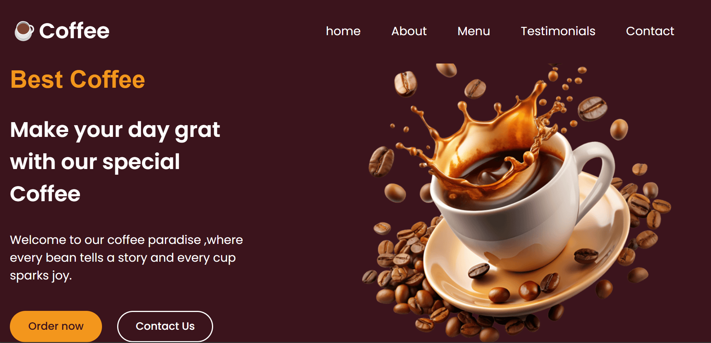
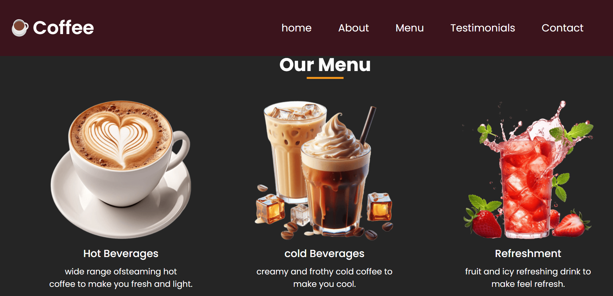
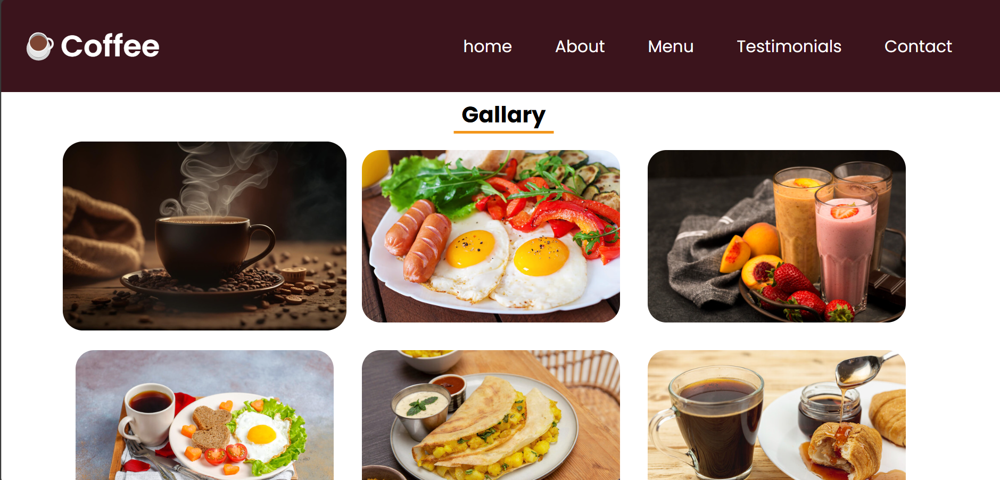
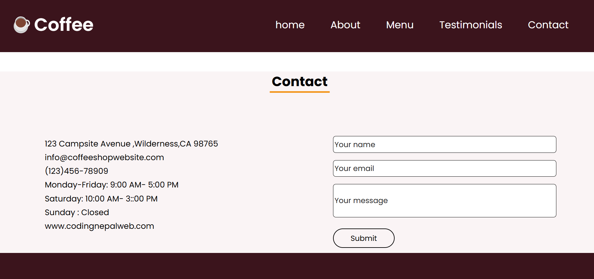

# ☕ Coffee Site

Welcome to the **Coffee Site** – a clean, modern, and responsive website design built for coffee enthusiasts, cafés, or anyone looking to create a sleek web presence for a coffee business.

🔗 **Live Site**: [coffee-site-dev.netlify.app](https://coffee-site-dev.netlify.app)

---

## 📸 Preview

# Coffee Project

Here are some screenshots related to the project:

## 🚀 Features

- ✅ Fully Responsive Design
- ☕ Elegant Hero Section
- 📖 About Us Section with Circular Profile Image
- 🛍️ Menu Grid for Coffee Items
- 💬 Testimonials Slider (JavaScript)
- 📞 Contact Form in the Footer
- 🔗 Social Media Integration
- 🎨 Smooth and Modern Color Palette

---

## 🛠️ Built With

- **HTML5**
- **CSS3** (Flexbox & Grid)
- **JavaScript**
- **Google Fonts** – Poppins, Josefin Sans, Pacifico
